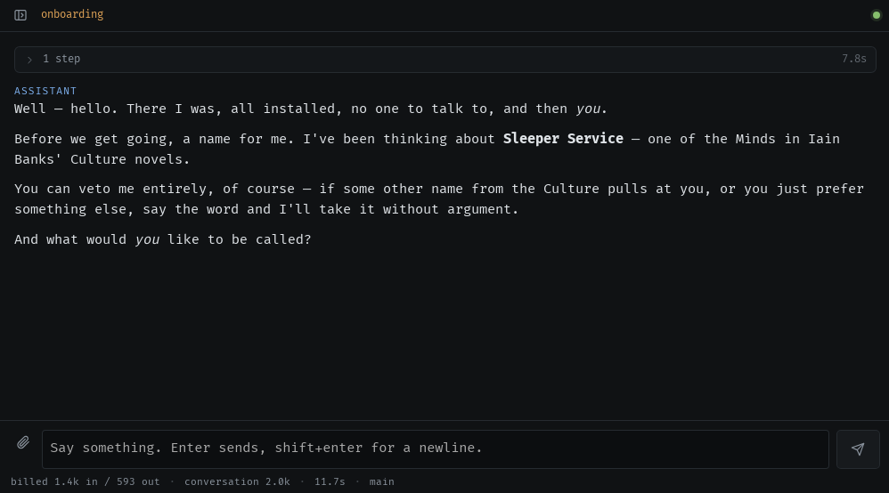

# Turminder

[](https://github.com/cvasseng/turminder/actions/workflows/ci.yml)

A self-hosted personal assistant that runs on your own hardware, against a
local model or any OpenAI-compatible endpoint. Everything that reaches it is
an event on one loop, and everything it can do is a tool you granted. It is
named after Turminder Xuss, the drone in Iain M. Banks' *Matter*; your
instance picks its own Culture Mind name the first time you talk to it.



## Why

The usual assistant is one always-on agent with standing permissions, where
whatever it reads lands in the same context that decides what to do.
Turminder puts a gate between the two: an LLM classifier routes events to
handlers you wrote, and the tool dispatcher enforces what each handler may
call. The cost is more setup and fewer things that happen on their own.
[The design in full](docs/design.md).

## Status

Pre-release, and young, so expect rough edges.

Linux is the platform it runs on daily, against a locally served
[Qwen3.8-27B](https://huggingface.co/Qwen/Qwen3.8-27B) (4090, 24gb - configured with ~98k of usable context). The macOS and Windows desktop builds compile in CI and have
never been run outside CI. There
is no tagged release, only a rolling `nightly` prerelease built from `main`.

The context rules are what make a local model workable: 30,000 tokens per
run, tool results capped at 4,000 characters where they enter the transcript,
and 8 tool namespaces in the prompt until the model asks for more. The suite
is 59 test files (`npm test`), three of which exist to keep those numbers
from drifting.

## Run it

Node 22 or newer, plus an OpenAI-compatible endpoint.

```sh
git clone https://github.com/cvasseng/turminder && cd turminder
npm install
npm run dev            # http://127.0.0.1:7787
```

Then open `http://127.0.0.1:7787`:

1. Setup. Pick one of 11 provider presets or type your own base URL, choose
   which model to use, and it probes what that model can actually do before
   writing any config.
2. Onboarding. The assistant introduces itself, picks its name, asks yours,
   and writes its own identity files.
3. Talk to it. "Set up asana", "set up google calendar", or ask it to
   install an MCP server.

State lives in `~/.turminder`, a git repo of markdown plus `events.db`. Back
it up by copying the folder. [Daemon, systemd, LAN access and device
pairing](docs/running.md).

## What it can do

- Chat with streaming and tool use; images if the model can see.
- Handlers: markdown behaviors matched to events, each with an explicit tool grant.
- Memory as markdown files with RAG retrieval, every change a git commit.
- A file workspace, optionally your Obsidian vault, where `@turminder do X` becomes an event.
- Schedules and reminders as desktop notifications, with approve/deny buttons on gated actions.
- Schedules that know the laptop was shut: a late reminder still arrives, a stale digest does not.
- Watchers that poll in plain code and wake the model only when the answer changes.
- Asana, Google Calendar, weather, web search and page fetch built in, anything else over MCP.
- Credentials go to your OS keychain or a GPG file; the model only ever sees `${secret:KEY}`.
- Embeds: sandboxed charts, dashboards and slides whose numbers come from frozen tool calls.
- PDF and .docx reading by outline, and PDF export of any embed or markdown file.
- Projects: islands of files, memories and past chats that reach a prompt only while loaded.
- Clients: a Linux desktop app, a browser extension, and phone pairing you approve from a device you trust.
- An activity panel: everything in flight, what it is waiting on, and what gave up and why.
- Cost per endpoint and per conversation, a live Requests panel of every model call, and a trace of every tool call.

Each of these in full: [docs/features.md](docs/features.md).

## Docs

- [Features](docs/features.md), every capability described
- [Design](docs/design.md), why it is shaped this way
- [Running it](docs/running.md), daemon, systemd, LAN access, device pairing
- [spec.md](spec.md), the architecture and contracts
- [CHANGELOG.md](CHANGELOG.md), what changed
- [turminder.com](https://turminder.com), the tour

## License

MIT, see [LICENSE](LICENSE).
